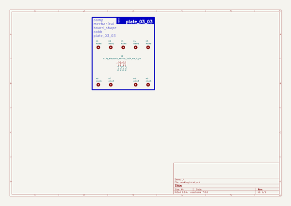
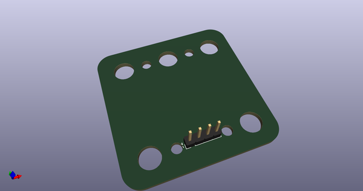
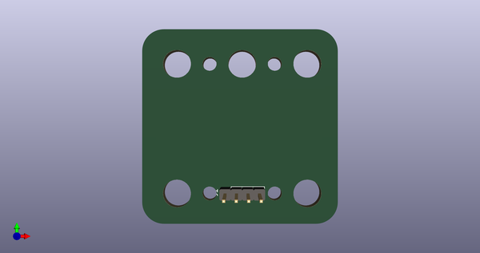
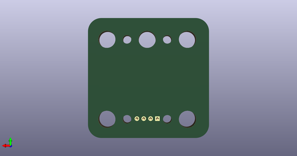
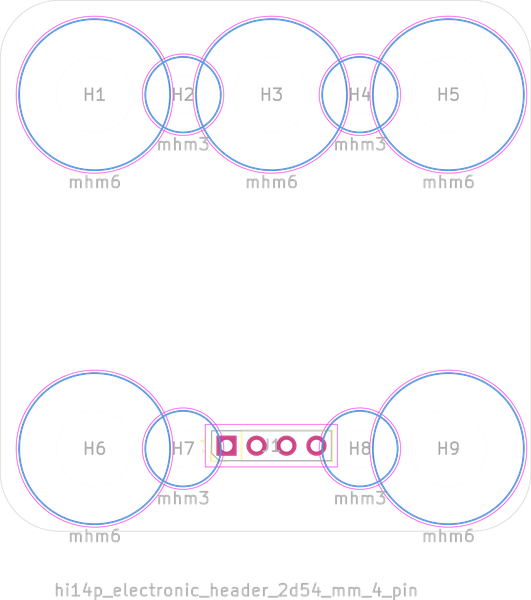

# 

## schematic  
  
[schematic (pdf)](kicad/current_version/working/working_schematic.pdf)  

## pcb  
 
  
  
  
[board (pdf)](kicad/current_version/working/working.pdf)  

## working_bom
| Id | Designator | Footprint | Quantity | Designation | Supplier and ref |  | None | 
| --- | --- | --- | --- | --- | --- | --- | --- | 
| 1 | H2,H8,H7,H4 | [electronic_mounting_hole_m3](https://github.com/oomlout/oomlout_oomp_part_src/tree/main/parts/electronic_mounting_hole_m3/working) | 4 | mhm3 |  |  | [''] | 
| 2 | J1 | [electronic_header_2d54_mm_4_pin](https://github.com/oomlout/oomlout_oomp_part_src/tree/main/parts/electronic_header_2d54_mm_4_pin/working) | 1 | hi14p_electronic_header_2d54_mm_4_pin |  |  | [''] | 
| 3 | H9,H3,H5,H1,H6 | [electronic_mounting_hole_m6](https://github.com/oomlout/oomlout_oomp_part_src/tree/main/parts/electronic_mounting_hole_m6/working) | 5 | mhm6 |  |  | [''] | 

note: the bom as exported by kicad pcb

## working_bom_schematic
| Ref | Qnty | Value | Cmp name | Footprint | Description | Vendor | DNP | 
| --- | --- | --- | --- | --- | --- | --- | --- | 
| H1, H3, H5, H6, H9 | 5 | mhm6 | mhm6_electronic_mounting_hole_m6 | oomlout_oomp_part_footprints:mhm6_electronic_mounting_hole_m6 | [electronic_mounting_hole_m6](https://github.com/oomlout/oomlout_oomp_part_src/tree/main/parts/electronic_mounting_hole_m6/working)   |  |  | 
| H2, H4, H7, H8 | 4 | mhm3 | mhm3_electronic_mounting_hole_m3 | oomlout_oomp_part_footprints:mhm3_electronic_mounting_hole_m3 | [electronic_mounting_hole_m3](https://github.com/oomlout/oomlout_oomp_part_src/tree/main/parts/electronic_mounting_hole_m3/working)   |  |  | 
| J1 | 1 | hi14p_electronic_header_2d54_mm_4_pin | hi14p_electronic_header_2d54_mm_4_pin | oomlout_oomp_part_footprints:hi14p_electronic_header_2d54_mm_4_pin | [electronic_header_2d54_mm_4_pin](https://github.com/oomlout/oomlout_oomp_part_src/tree/main/parts/electronic_header_2d54_mm_4_pin/working)   |  |  | 

the bom as exported by kicad schematic

## working_parts
| designator | oomp_key | placed | note | position_x | position_y | rotation | offset_x | offset_y | 
| --- | --- | --- | --- | --- | --- | --- | --- | --- | 
| H1 | [oomp_electronic_mounting_hole_m6](https://github.com/oomlout/oomlout_oomp_part_src/tree/main/parts/electronic_mounting_hole_m6/working) |  |  | -15 | 15 |  |  |  | 
| H2 | [oomp_electronic_mounting_hole_m6](https://github.com/oomlout/oomlout_oomp_part_src/tree/main/parts/electronic_mounting_hole_m6/working) |  |  | -7.5 | 15 |  |  |  | 
| H3 | [oomp_electronic_mounting_hole_m6](https://github.com/oomlout/oomlout_oomp_part_src/tree/main/parts/electronic_mounting_hole_m6/working) |  |  | 0 | 15 |  |  |  | 
| H4 | [oomp_electronic_mounting_hole_m6](https://github.com/oomlout/oomlout_oomp_part_src/tree/main/parts/electronic_mounting_hole_m6/working) |  |  | 7.5 | 15 |  |  |  | 
| H5 | [oomp_electronic_mounting_hole_m6](https://github.com/oomlout/oomlout_oomp_part_src/tree/main/parts/electronic_mounting_hole_m6/working) |  |  | 15 | 15 |  |  |  | 
| H6 | [oomp_electronic_mounting_hole_m6](https://github.com/oomlout/oomlout_oomp_part_src/tree/main/parts/electronic_mounting_hole_m6/working) |  |  | -15 | -15 |  |  |  | 
| H7 | [oomp_electronic_mounting_hole_m6](https://github.com/oomlout/oomlout_oomp_part_src/tree/main/parts/electronic_mounting_hole_m6/working) |  |  | -7.5 | -15 |  |  |  | 
| H8 | [oomp_electronic_mounting_hole_m6](https://github.com/oomlout/oomlout_oomp_part_src/tree/main/parts/electronic_mounting_hole_m6/working) |  |  | 7.5 | -15 |  |  |  | 
| H9 | [oomp_electronic_mounting_hole_m6](https://github.com/oomlout/oomlout_oomp_part_src/tree/main/parts/electronic_mounting_hole_m6/working) |  |  | 15 | -15 |  |  |  | 
| J1 | [oomp_electronic_header_2d54_mm_4_pin](https://github.com/oomlout/oomlout_oomp_part_src/tree/main/parts/electronic_header_2d54_mm_4_pin/working) |  |  | -3.81 | -14.75 | 90 |  |  | 

note: a manually generated file for taking notes and positioning components

## oomp_parts_summary
| index | designator | quantity | oomp_id | 
| --- | --- | --- | --- | 
| 1 | H2,H8,H7,H4 | 4 | [electronic_mounting_hole_m3](https://github.com/oomlout/oomlout_oomp_part_src/tree/main/parts/electronic_mounting_hole_m3/working) [mhm3](https://github.com/oomlout/oomlout_oomp_part_src/tree/main/parts/electronic_mounting_hole_m3/working) [Electronic Mounting Hole M3](https://github.com/oomlout/oomlout_oomp_part_src/tree/main/parts/electronic_mounting_hole_m3/working)   | 
| 2 | J1 | 1 | [electronic_header_2d54_mm_4_pin](https://github.com/oomlout/oomlout_oomp_part_src/tree/main/parts/electronic_header_2d54_mm_4_pin/working) [hi14p](https://github.com/oomlout/oomlout_oomp_part_src/tree/main/parts/electronic_header_2d54_mm_4_pin/working) [Electronic Header 2D54 Mm 4 Pin](https://github.com/oomlout/oomlout_oomp_part_src/tree/main/parts/electronic_header_2d54_mm_4_pin/working)   | 
| 3 | H9,H3,H5,H1,H6 | 5 | [electronic_mounting_hole_m6](https://github.com/oomlout/oomlout_oomp_part_src/tree/main/parts/electronic_mounting_hole_m6/working) [mhm6](https://github.com/oomlout/oomlout_oomp_part_src/tree/main/parts/electronic_mounting_hole_m6/working) [Electronic Mounting Hole M6](https://github.com/oomlout/oomlout_oomp_part_src/tree/main/parts/electronic_mounting_hole_m6/working)   | 

Search Links: (L) - lcsc, (D) - digikey, (M) - mouser, (N) - newark, (SZ) - szlcsc
note: a work on progress that takes the bom file from kicad pcb and try's to add oomp details

